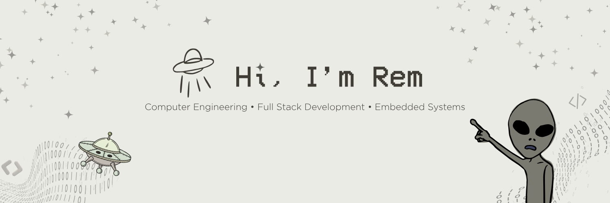
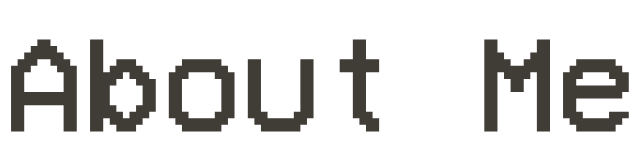
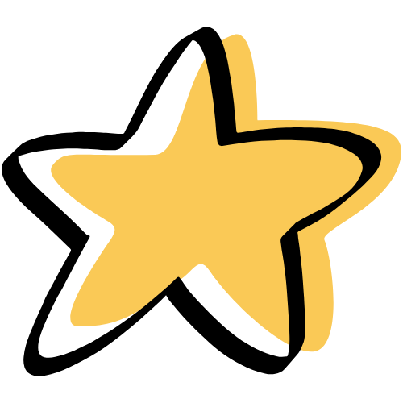

  

<dl>
  <dd>
    
I’m a <strong>Computer Engineering undergraduate</strong> bridging the gap between embedded hardware and full-stack software. Driven by hands-on prototyping, I design autonomous robotics and build end-to-end applications through fast-paced hackathons.

  </dd>
</dl>

 <strong>Hackathon Builder:</strong> Regional &amp; national competitor with winning builds including <strong>CivicLens</strong>, <strong>SurePay</strong>, and <strong>Cardea</strong>.

 <strong>Robotics &amp; AI:</strong> Exploring applied Machine Learning to replace traditional PID control in autonomous robotic systems.

 <strong>Tech Leadership:</strong> Former VP-Internal at <strong>ICpEP.SE</strong>, AI/ML Officer at <strong>GDG on Campus</strong>, and Finance Officer at <strong>AWS Cloud Club</strong>.

 

<!--
**HumbaAdob0/HumbaAdob0** is a ✨ _special_ ✨ repository because its `README.md` (this file) appears on your GitHub profile.

Here are some ideas to get you started:

- 🔭 I’m currently working on ...
- 🌱 I’m currently learning ...
- 👯 I’m looking to collaborate on ...
- 🤔 I’m looking for help with ...
- 💬 Ask me about ...
- 📫 How to reach me: ...
- 😄 Pronouns: ...
- ⚡ Fun fact: ...
-->
